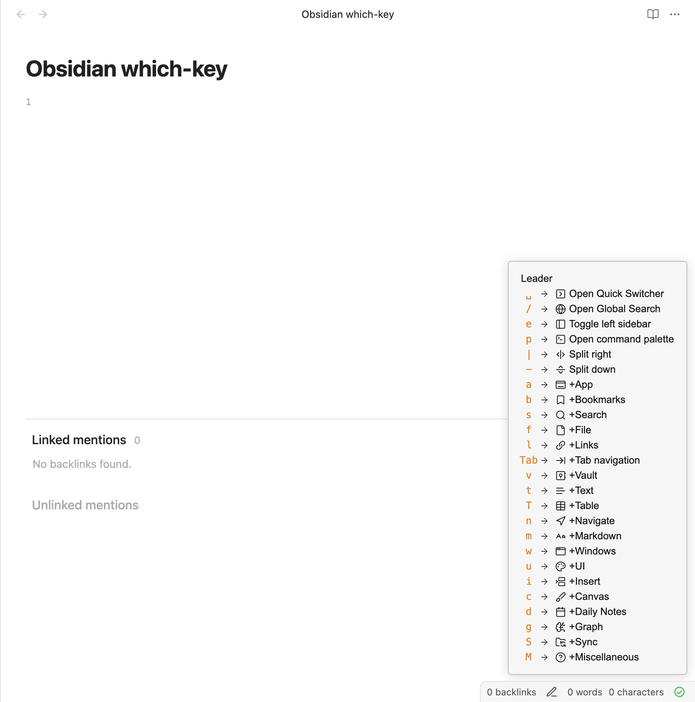
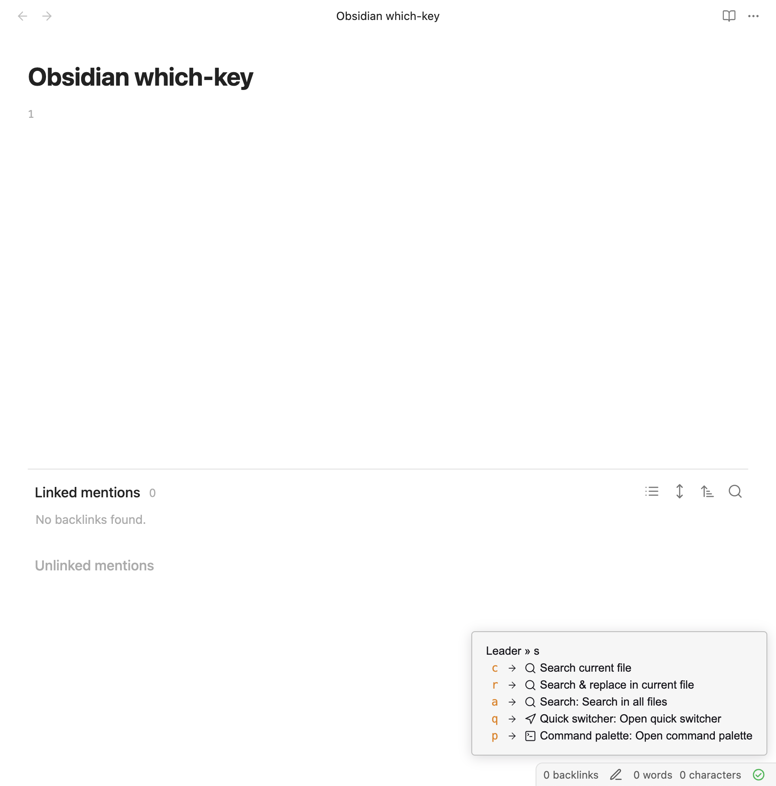

# Obsidian Which-Key

<!--  -->
<!--  -->

## Introduction

Brings which-key functionality familiar to Vim and Emacs users to Obsidian.

Which-key provides direct access to all of Obsidian's commands through a sequence of keystrokes, each stroke displaying a menu of potential commands for the next keystroke.

## Usage

If Vim mode is enabled, which-key emulates spacemacs/vim by triggering when Space is pressed. The trigger can also be set to a hotkey.

## Installation

Which-key is currently in beta. Either:

- Clone this repository into the `.obsidian/plugins` folder of the desired vault.
- Download the repository as a zip file and extract it into `.obsidian/plugins`.
